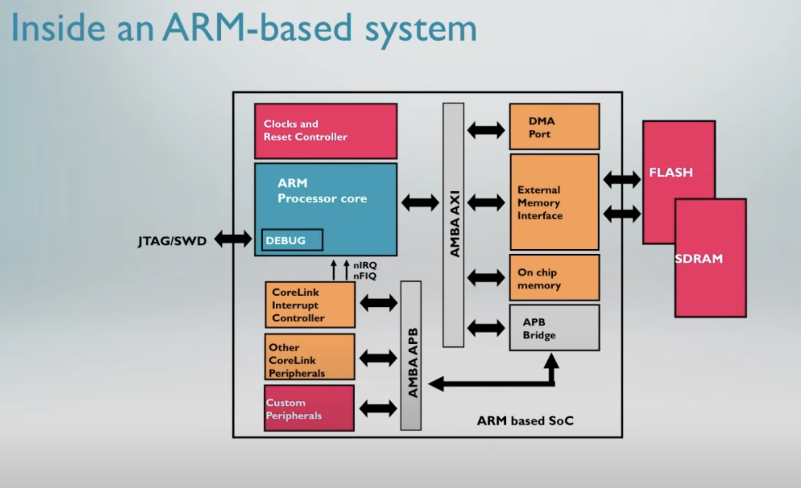
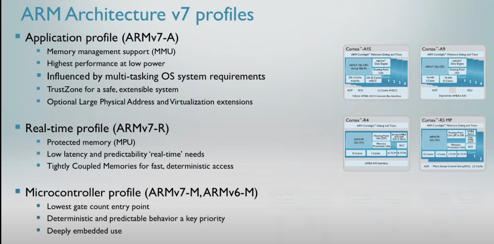
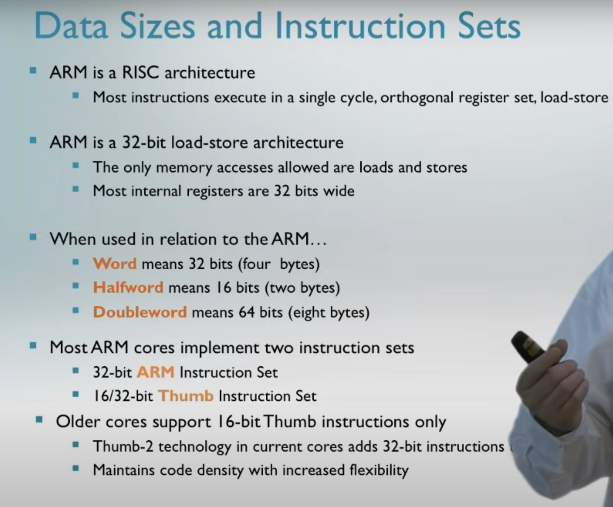
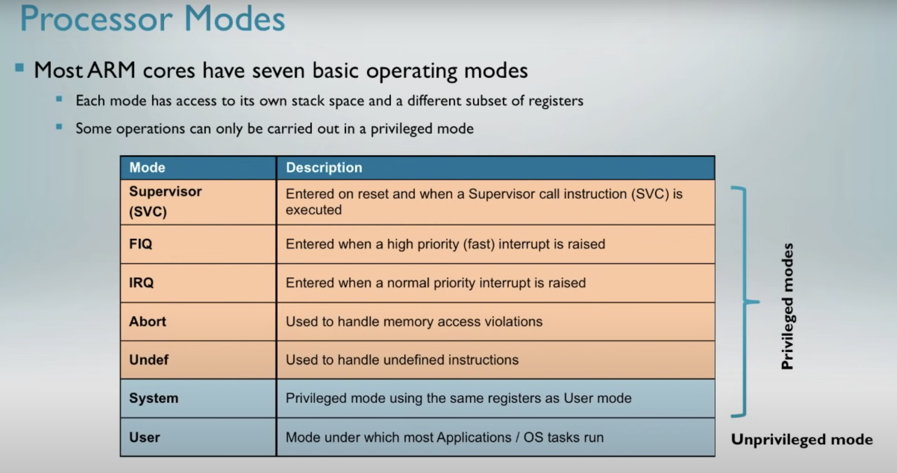
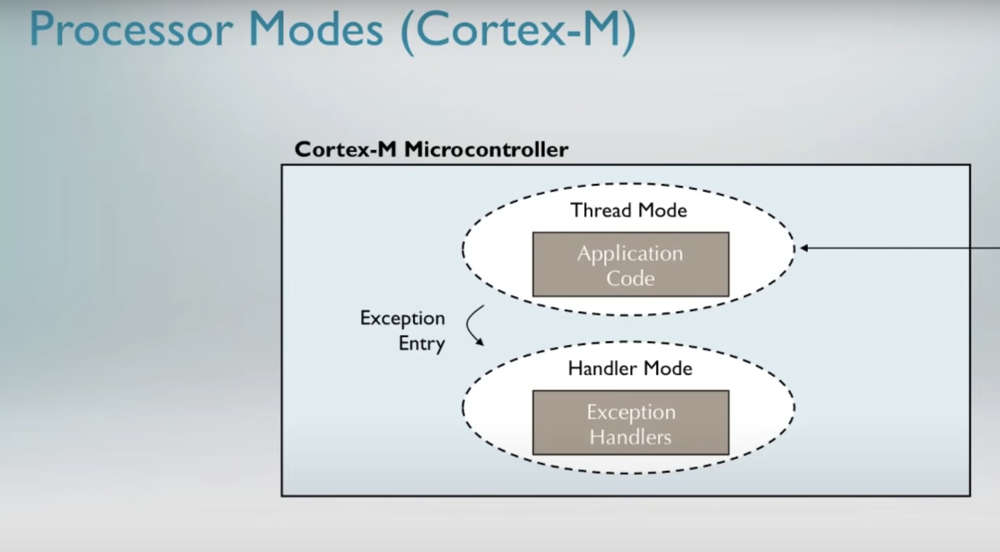
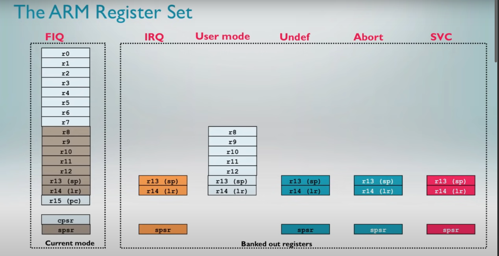
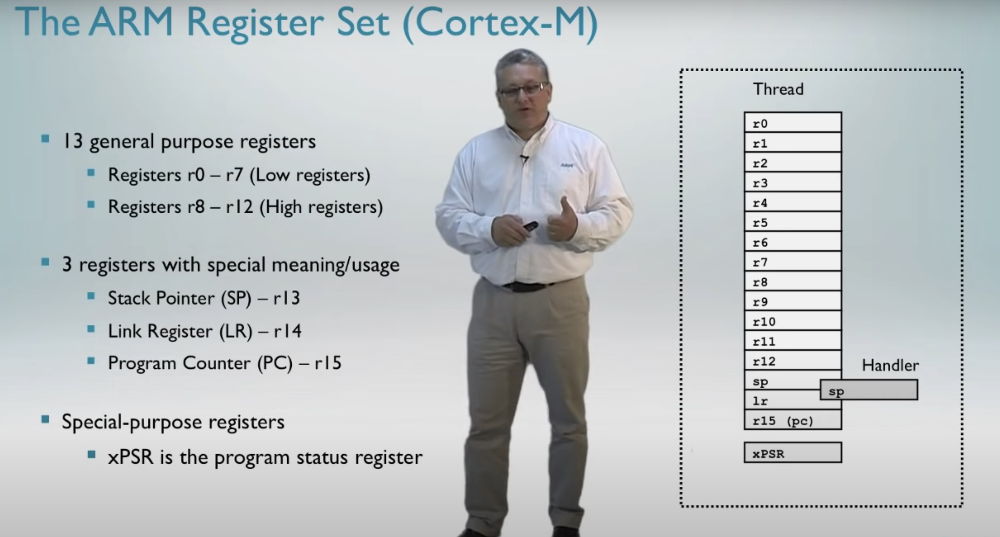
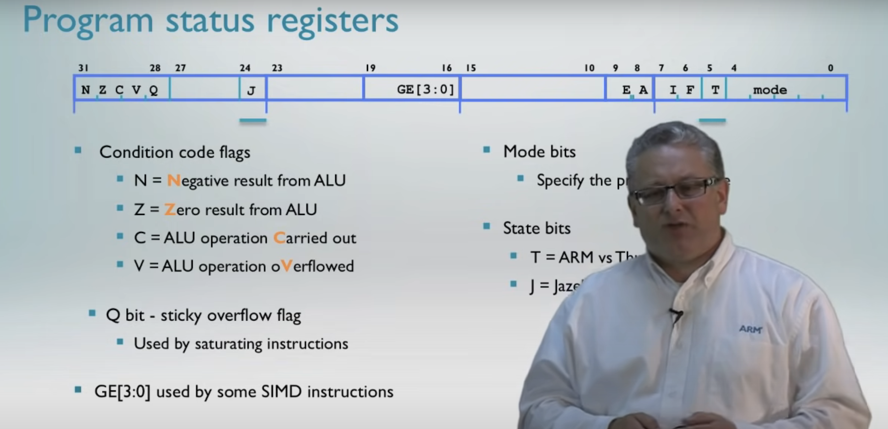
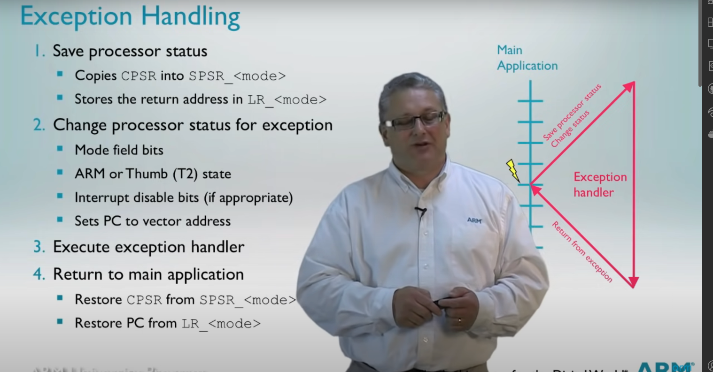
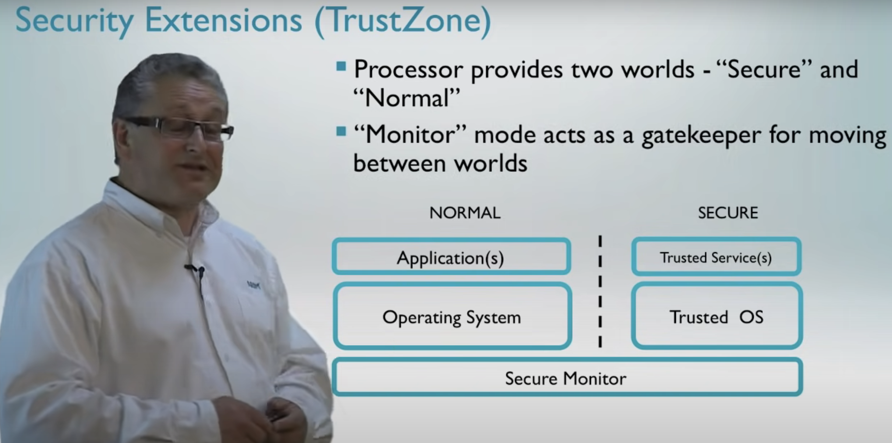

### Intel

CISC

### ARM

RISC

# **Advance RISC Machine**:  
RISC, or **Reduced Instruction Set Computer**, is a type of microprocessor architecture that utilizes a small, highly-optimized set of instructions¹². This is in contrast to the Complex Instruction Set Computing (CISC) architecture which uses a more specialized set of instructions¹².  

The key operational concept of the RISC computer is that each instruction performs only one function (e.g., copy a value from memory to a register)¹. The goal is to offset the need to process more instructions by increasing the speed of each instruction, in particular by implementing an instruction pipeline, which may be simpler to achieve given simpler instructions¹.  

