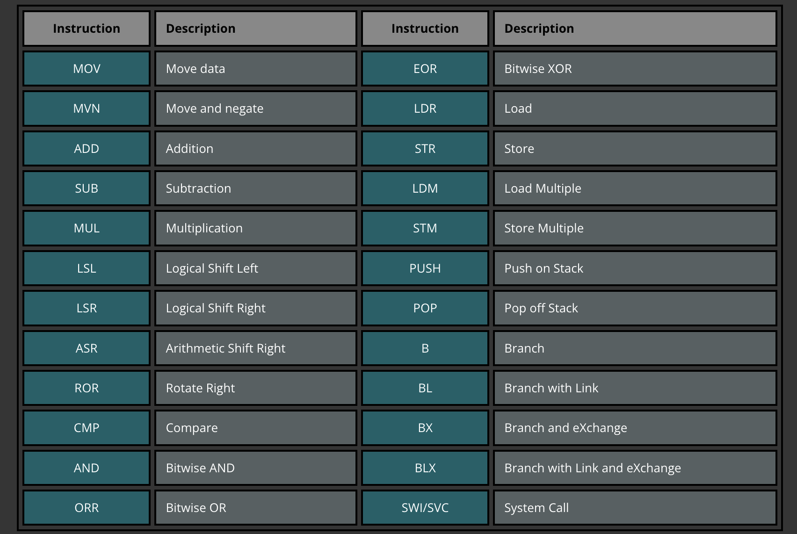

[CPUlator ARMv7 System Simulator](https://cpulator.01xz.net/?sys=arm)    

Compile  .s file:
1. ``` as helloworld.s -o helloworld.o```
2. ``` ld helloworld.o -o helloworld```
3. ```ls```
4. ```./helloworld```

Debug with GDB:
1. ```gdb helloworld```
2. ```breakpoint 1 at 0x10074```
3. ```run```   
```nexti 3 ```    to run the next 3 instructions 
4. ```layout asm```
5. ``` info register r0``` or ```layout regs```  
control+x and O can switch the layout window
6. ```stepi```  next step
7. ```x/10x $r1``` 10 hexadecimal memory slots  
(0x20098: 0x.... 0x.... 0x.... 0x....  
0x200a8: 0x.... 0x.... 0x.... 0x....  
0x200b8: 0x.... 0x....  )  
x means examine   
10x means 10 hexidecimal  
d is decimal  
u is unsigned decimal
c is char    
``x/w 0x1009e``  


[GDB cheatsheet](https://eecs370.github.io/resources/gdb_refcard.pdf)  


Disassenbly:
1. `ldr`: The `ldr` instruction is used to load a value from memory into a register. For example, `ldr r0, [r1]` loads the value at the memory address contained in `r1` into `r0`⁶. The value loaded can be a 32-bit constant⁵.

2. `andeq`: This is a conditional execution instruction that performs a bitwise AND operation only if the Zero flag is set. However, in disassembled code, you might see `andeq` in places where it doesn't make sense, such as in the vector table. This is because the disassembler is interpreting data (like addresses) as if they were instructions.

3. `svc`: The `svc` instruction is used to generate a supervisor call, which is used to carry out privileged operations from within an OS Kernel. The immediate operand to `svc` does not determine the vector to the exception handler. Instead, the vector is always obtained by taking the vector base address from the system register `VBAR_EL1` and adding an offset determined by the type of exception and the exception level.  





# Stack
